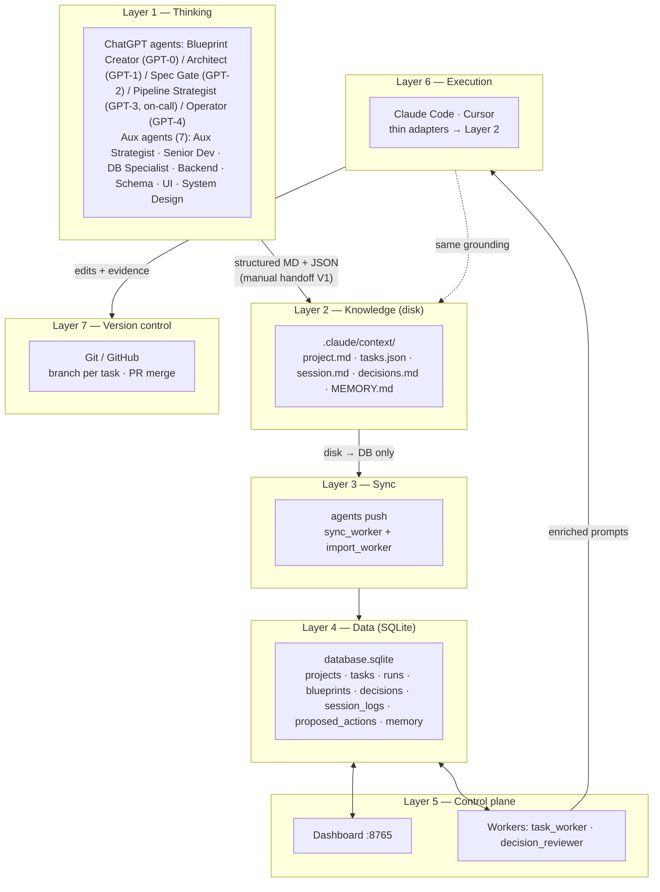
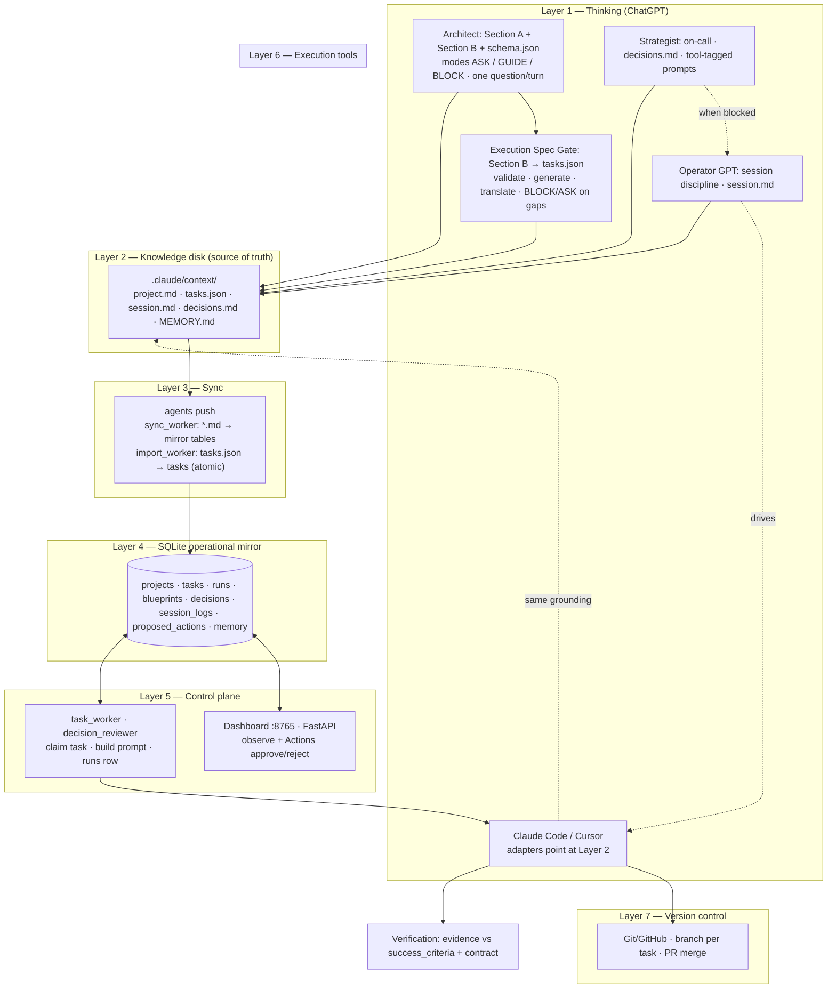
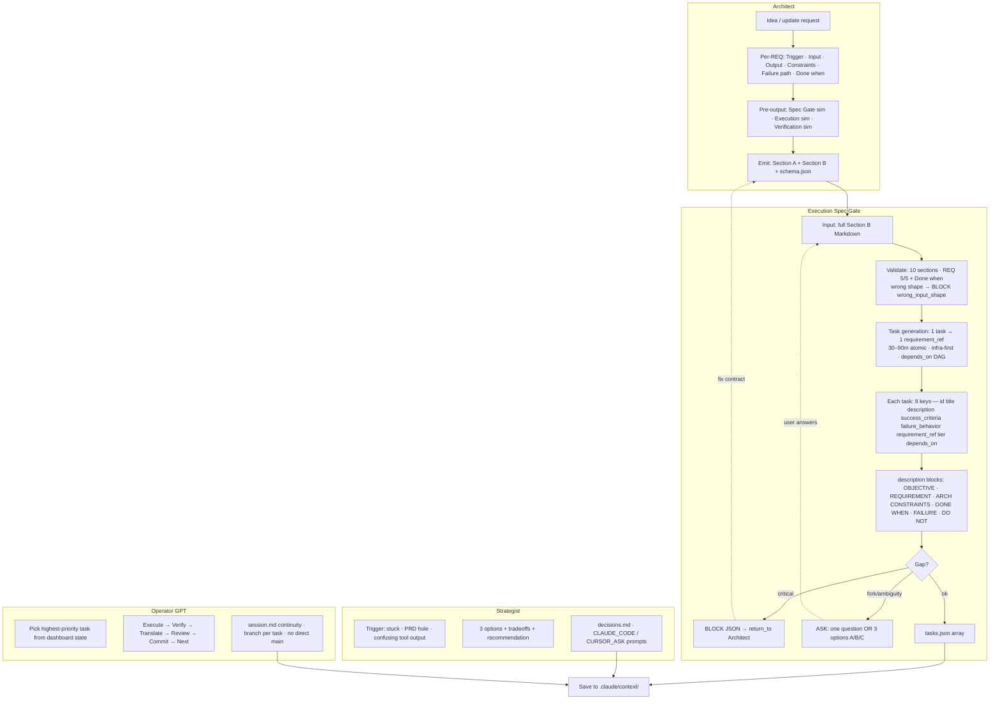
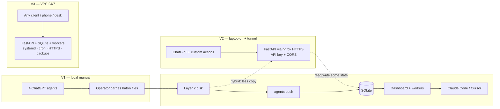
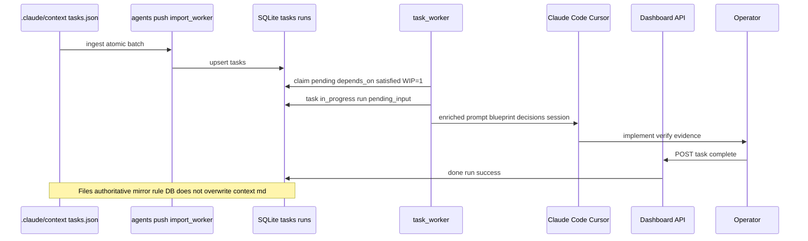
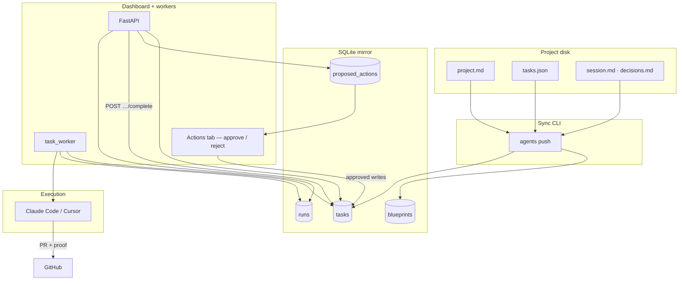
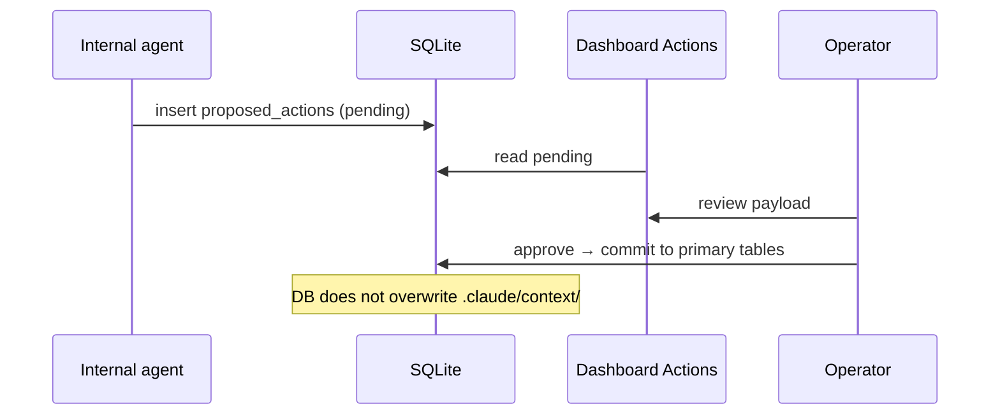

# Vertical data flow — full system

End-to-end views of the MGPOD / agent-system stack: [This framework outlines](../tier-1/this-framework-outlines.md), [Personal D V1–V3](../tier-2/personal-d-versions-v1-v2-v3.md), [4 ChatGPT agents](../tier-3/chatgpt-agents-thinking-layer.md), and tier-2 operational docs.

**Vertical** means top-to-bottom: thinking → authored disk truth → sync → SQLite mirror → dashboard/workers → execution tools → git, with human gates. **V1 / V2 / V3** are deployment phases on the same conceptual stack, not three different architectures.

---

## 1. Seven layers (compact overview)

Authored knowledge flows **down** into the control plane; execution produces code and evidence in **version control**. The database **mirrors** disk; it does not replace `.claude/context/`.

---

## 2. End-to-end pipeline (contracts → execution → verification)

Aligned with [Architect pipeline](prompt/architect.md): Blueprint Creator (draft bundle) → Architect → Execution Spec Gate (`tasks.json`) → Operator → execution → verification (evidence vs `success_criteria`; subjective claims invalid).

---

## 3. Layer 1 detail — four roles + Spec Gate internals

**Architect** produces requirement contracts and Section B. **Execution Spec Gate** is a mechanical translator and quality gate (see [spec_gate.md](../spec-gate/prompt/spec_gate.md), [gap_handling.md](../spec-gate/knowledge/gap_handling.md)).

---

## 4. V1 / V2 / V3 — same stack, different attachment

Phased roadmap: prove at scale 1, then remote API, then 24/7 VPS ([Personal D versions](../tier-2/personal-d-versions-v1-v2-v3.md)).

---

## 5. Vertical slice — one task from `tasks.json` to done

---

## 6. Operational slice (flowchart)

Typical path from mirrored state through dashboard, workers, and git.

---

## 7. Proposed-actions gate (agent writes)

Internal agents stage changes; humans commit them to operational tables after review ([SQLite operational mirror](../tier-2/sqlite-operational-mirror.md)).

---

## Related docs

- [Sync layer](../tier-2/sync-layer.md) — registry, artifacts, task ingestion.
- [Workers operational bridge](../tier-2/workers-operational-bridge.md) — `--import`, `--execute`, decision reviewer.
- [Dashboard FastAPI](../tier-2/dashboard-fastapi-backend.md) — APIs, observe vs control.
- [Architect prompt](prompt/architect.md) — contract and validation simulations.
- [Execution Spec Gate prompt](../spec-gate/prompt/spec_gate.md) — Section B → `tasks.json` rules.
