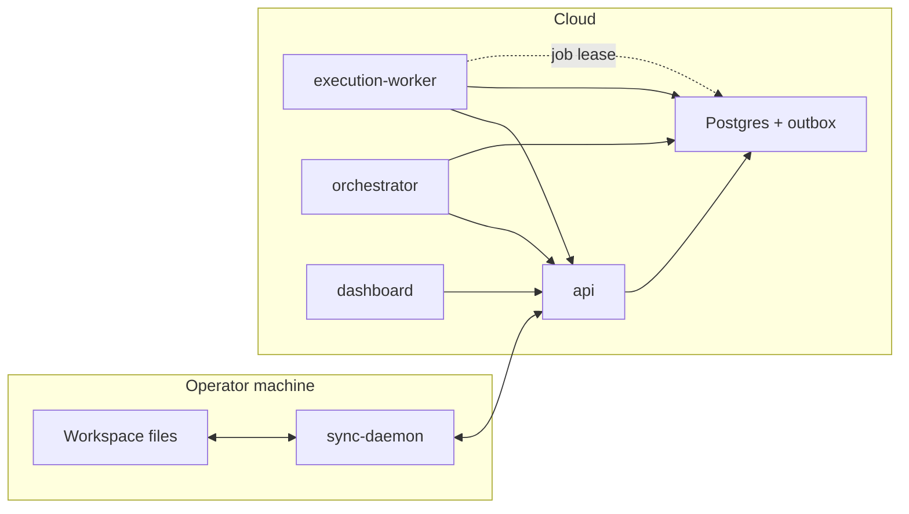
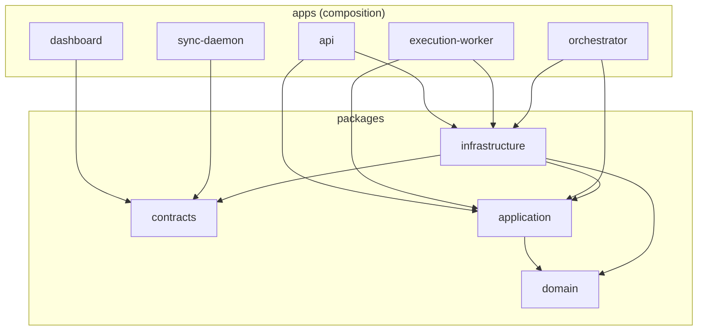

# ADR 0003: Repository structure for the AI operations platform

**Status:** Proposed  
**Date:** 2026-05-15  
**Depends on:** [0001-system-ownership.md](./0001-system-ownership.md), [0002-source-of-truth-matrix.md](./0002-source-of-truth-matrix.md)

This ADR defines the **monorepo layout**, **dependency direction**, **runtime boundaries**, and **enforcement** for the new platform. It does not prescribe a specific build tool beyond principles; recommended stacks appear in §10.

---

## 1. Top-level folders

| Folder | Purpose |
|--------|---------|
| **`apps/`** | Deployable binaries: API, workers, daemon, dashboard shell, orchestrator. **Composition roots only**—thin adapters. |
| **`packages/`** | Reusable libraries: `domain`, `application`, `infrastructure`, `contracts`. **Published or path-deps** from apps; no app-to-app imports. |
| **`docs/`** | ADRs, runbooks, API specs (OpenAPI), architecture maps. |
| **`deploy/`** | IaC and release artifacts: Dockerfiles per app, Compose/K8s/Helm, migrations packaging, CI deploy configs. |
| **`tooling/`** | Repo-local scripts: codegen, lint rules, import-linter config, local dev orchestration (`Makefile`, `justfile`, Nx/turbo if adopted). |
| **`legacy/`** | Strangler home for `agent-system-base/` and other retired trees (**no new features**; expiry tracked in ADR). |
| **`catalog/`** | Versioned agent/content bundles (prompts, skills, plan templates). **Read-heavy**; consumed at build or via explicit catalog sync—not random repo paths at runtime. |

Optional (add when needed, not required on day one):

- **`e2e/`** — Cross-app black-box tests.
- **`fixtures/`** — Shared test data for packages and apps.

---

## 2. Repository tree (target)

```text
agents/
├── apps/
│   ├── api/                      # FastAPI (or similar) HTTP API
│   ├── sync-daemon/              # Local watcher + cloud client
│   ├── execution-worker/         # Job executor (LLM / subprocess)
│   ├── orchestrator/             # Plan engine service or CLI
│   └── dashboard/                # SPA + static server (or Vite + API-only)
├── packages/
│   ├── domain/                   # Entities, VO, domain events, pure policies
│   ├── application/              # Use cases, ports (Protocols), handlers
│   ├── infrastructure/         # Postgres, outbox dispatcher, S3, Anthropic, FS adapters
│   └── contracts/                # JSON Schema / OpenAPI fragments / event type defs (language-neutral where possible)
├── catalog/
│   └── README.md                 # How bundles are versioned, pinned, and released
├── deploy/
│   ├── compose/
│   ├── docker/
│   └── k8s/                      # optional
├── docs/
│   └── adr/
├── legacy/
│   └── agent-system-base/        # moved or symlinked during strangler
└── tooling/
    ├── import-linter.toml        # or equivalent boundary enforcement
    └── scripts/
```

Each **`apps/<name>/`** typically contains: `src/`, `pyproject.toml` or `package.json`, `Dockerfile` (or reference under `deploy/docker/`), `README.md` with run contract.

---

## 3. Apps — responsibilities and boundaries

### `apps/api`

- **Responsibility:** HTTP API for the cloud control plane: auth, commands, queries, sync ingest, job enqueue, orchestration control endpoints.
- **Contains:** Route handlers, request/response DTOs, dependency wiring (DI container), middleware, OpenAPI generation.
- **Must not:** Contain domain rules beyond input validation; open DB connections in routes without going through repositories; embed business branching copied from legacy scripts.
- **Depends on:** `packages/application`, `packages/infrastructure` (concrete adapters wired at startup), `packages/contracts` for schema reuse.

### `apps/sync-daemon`

- **Responsibility:** Local-first sync: watch workspace roots, debounce, compute patches, **push** to API with versioning, **pull** server state to projections, maintain local manifest / unsynced queue.
- **Contains:** Filesystem watchers, HTTP client to `api`, backoff/retry, local config reader.
- **Must not:** Run AI jobs; parse full project semantics for execution; write Postgres directly.
- **Depends on:** `packages/contracts` (payload shapes), thin `packages/application` **only if** shared sync use cases are extracted (optional); otherwise a small internal `sync_core` module later promoted to `packages/`.

### `apps/execution-worker`

- **Responsibility:** Lease **execution jobs** from Postgres (or queue), run **one job type pipeline** (LLM call, tool loop, subprocess sandbox), persist results and traces **via API or shared infra repos**—never by scanning the repo tree for “what to do.”
- **Contains:** Worker loop, job lease logic, telemetry, adapter registration for `LLMClient`, `ProcessRunner`.
- **Must not:** Implement document diffing or full-tree sync; embed orchestrator DAG logic (calls orchestrator or shared lib only if job type says so).
- **Depends on:** `packages/application` (use cases: `ExecuteJob`, `RecordJobResult`), `packages/infrastructure` (Anthropic adapter, blob upload).

### `apps/orchestrator`

- **Responsibility:** Multi-step plan engine: load pinned plan definition, advance state machine, enqueue child jobs, persist plan run state **through repositories / API**.
- **Contains:** Wave scheduler, handoff protocol, integration with `LLMClient` for structured steps.
- **Must not:** Append to `tasks.json` or other hidden files; mutate local workspace except via explicit **sync commands** or approved patch APIs.
- **Depends on:** `packages/domain` + `packages/application` + `packages/infrastructure` (or call `api` only—either pattern is allowed if ADR locks one).

### `apps/dashboard`

- **Responsibility:** Human UI: projects, documents, tasks, runs, approvals, sync status. **Browser client** of `api` only.
- **Contains:** Frontend code, generated API client from OpenAPI, auth token handling.
- **Must not:** Import Python packages; embed SQL; read local filesystem paths outside browser sandbox (except user-upload flows explicitly scoped).
- **Depends on:** `packages/contracts` optionally for TypeScript types codegen from JSON Schema.

---

## 4. Packages — responsibilities

### `packages/domain`

- **Contains:** Aggregates (`Project`, `Task`, `Document`, `PlanRun`, …), value objects (`Slug`, `Version`, `CorrelationId`), **domain events** as dataclasses/types, invariants and transition functions **pure** (no I/O).
- **Depends on:** Standard library + optional small pure libs (e.g. `pydantic` v2 for VO **only if** policy allows pure models without DB annotations).

### `packages/application`

- **Contains:** Use cases / application services, **port interfaces** (`TaskRepository`, `UnitOfWork`, `EventPublisher`, `LLMClient`, `Clock`), command/query handlers, transaction boundaries.
- **Depends on:** `packages/domain` **only** (not `infrastructure`).

### `packages/infrastructure`

- **Contains:** Postgres repositories, outbox writer + dispatcher, Anthropic client, object storage, filesystem adapters for **server-side** needs, migration runner wiring.
- **Depends on:** `packages/application` (implements ports), `packages/domain` (to map rows ↔ entities), `packages/contracts` (optional validation).

### `packages/contracts`

- **Contains:** JSON Schema for API bodies, event payloads, job payloads; OpenAPI fragments; optionally protobuf defs if adopted; **generated** TS types live in `apps/dashboard` via codegen from here—not hand-duplicated.
- **Depends on:** Nothing inward from other packages (may use dev tools only). This package is the **stable ABI** edge between teams and languages.

**Optional later splits** (only when size demands):

- `packages/testing/` — factories, fake repos, in-memory outbox.

---

## 5. Dependency rules (strict)

| Layer | May import | Must not import |
|-------|------------|------------------|
| **`packages/domain`** | stdlib, allowed pure libs | `application`, `infrastructure`, any `apps/*`, `fastapi`, `sqlalchemy`, `psycopg`, `anthropic`, `pathlib` **for business paths** (VO path types as strings are OK) |
| **`packages/application`** | `domain` | `infrastructure`, `apps/*`, concrete DB/HTTP clients |
| **`packages/infrastructure`** | `application` (ports), `domain`, `contracts` | `apps/*` |
| **`apps/*`** | `application`, `infrastructure`, `contracts`, `domain` **only for wiring** | Cross-app imports (no `from apps.api import ...` in worker) |

**Composition rule:** `apps/*` wires concrete classes into handlers; **handlers call one use case** per request/job tick.

**Enforcement (required in CI):**

- **Import linter** (e.g. `import-linter`, `tach`, or Ruff with custom rules) with contracts matching the table above.
- **Optional:** `mypy --strict` on `domain` + `application`.

---

## 6. Communication rules

| Rule | Rationale |
|------|-----------|
| **No direct DB access from dashboard** | All reads/writes go through `api`; enables authz, auditing, and single SoT per [0002](./0002-source-of-truth-matrix.md). |
| **No filesystem logic in domain** | Paths and FS are infrastructure; domain uses opaque handles / IDs. |
| **No AI clients inside use cases** | Use cases depend on `LLMClient` **port**; infrastructure provides `AnthropicLLMClient`. |
| **All state transitions emit outbox events** | Same transaction as canonical row update; consumers are projectors, webhooks, analytics ([0001](./0001-system-ownership.md) §5). |

**API style:** Commands return **ids + version**; queries return **read DTOs**; sync uses **ETags** or integer versions.

---

## 7. Deployment boundaries

| App | Deploy independently? | Why |
|-----|-------------------------|-----|
| **`api`** | **Yes** | Scales with control-plane traffic; different SLO from workers; owns DB migrations application. |
| **`dashboard`** | **Yes** | Static assets + CDN; separate release cadence from API (still contract-tested against OpenAPI). |
| **`execution-worker`** | **Yes** | CPU/GPU/API-rate limits; horizontal autoscale; **must** scale without coupling to API instances. |
| **`orchestrator`** | **Yes** (recommended) | Long-running DAGs, different blast radius; can be scaled to zero when idle if job model supports cold start. |
| **`sync-daemon`** | **No (per user machine)** | Not a cloud deploy target; distributed as **signed binary/installer** or package (brew, pipx). Documented separately in `deploy/` as **client release**, not K8s service. |

**Shared dependency:** All server apps use the **same DB schema version**; migrations owned by **`api`** or a dedicated `packages/infrastructure/migrations` invoked only from one release job to avoid races.

---

## 8. Local development workflow

### Workspace structure

- Developer clones monorepo and has a **workspace root** (e.g. `~/work/acme`) registered in local config pointing at `project_id` in the cloud.
- **`catalog/`** is read-only during normal dev unless authoring catalog PRs.

### Daemon behavior

- Run `apps/sync-daemon` against `WORKSPACE_ROOT` + `API_URL` + credentials.
- Daemon watches **allowlisted globs** (e.g. `.claude/governance/memory.md` for MVP); pushes produce **version conflicts** visible in CLI and dashboard.

### API interaction

- `api` runs via `deploy/compose` or `tilt` with Postgres + outbox dispatcher (can be same process in dev **only** with explicit `DEV_COMBINED_MODE=1` flag—never default in prod).

### Environment config

- **`.env.example`** per app under `apps/<app>/` + root **`.env.local`** gitignored.
- **No secrets in repo**; daemon tokens from env or OS keychain wrapper (future ADR).

### Testing boundaries

| Scope | Where |
|-------|--------|
| **Domain/Application unit tests** | `packages/domain/tests`, `packages/application/tests` — no network, fake clocks, fake repos. |
| **Infrastructure integration tests** | `packages/infrastructure/tests` — Testcontainers Postgres. |
| **App smoke tests** | `apps/api/tests` — API with in-memory or container DB. |
| **Cross-app e2e** | `e2e/` (optional) — Compose stack, black-box HTTP. |

**Rule:** Workers and daemon tests **must not** require the full catalog tree unless testing catalog resolution explicitly.

---

## 9. Anti-patterns (merge-blocking)

| Ban | Detection |
|-----|-----------|
| **Shared mutable globals** | Linters + no module-level mutable singletons except explicit DI container factories scoped to process. |
| **Hidden filesystem side effects** | Code review + forbid `Path.write*` in `application` / `domain` via path filters in CI. |
| **Random subprocess orchestration** | Subprocess only behind `ProcessRunner` port; allowlist commands per job type. |
| **Sync logic inside execution workers** | Import linter: workers cannot import `sync` modules or `watchdog`. |
| **Infrastructure leaking into domain** | Import linter + no SQL strings in `packages/domain`. |

---

## 10. Recommended technology boundaries (non-binding)

| Concern | Suggested default |
|---------|-------------------|
| **Monorepo orchestration** | `uv` workspace or `Poetry` multi-project; or **Polyglot**: Python packages + pnpm for dashboard with Turborepo. |
| **API** | FastAPI + Pydantic v2 + `uvicorn`. |
| **Dashboard** | React + Vite + TanStack Query; OpenAPI-generated client. |
| **DB access** | `asyncpg` or SQLAlchemy 2 async in **infrastructure only**; repositories return domain types. |
| **Migrations** | Alembic or `sqitch`-style SQL in `packages/infrastructure/migrations`. |
| **Events** | Postgres outbox table + dispatcher loop (same repo as `api` or `tooling/outbox-dispatcher` binary). |

---

## 11. Runtime relationships (logical)



**Catalog** flows: CI or `api` admin path pulls pinned `catalog` release into runtime image—**not** shown as continuous runtime traffic.

---

## 12. Dependency graph (packages + apps)



**Forbidden edge:** `domain --> application`, `application --> infrastructure`, `dashboard --> api` at **import** level (HTTP only).

---

## 13. Enforcement rules (checklist for CI and review)

1. **Import graph** matches §5; CI fails on violation.
2. **Every PR** that introduces a **new writer** updates [0002](./0002-source-of-truth-matrix.md).
3. **Use case** files contain **no** `open(`, `requests.`, `anthropic.`, `psycopg`, `asyncpg`.
4. **Handlers** (apps) are **< ~50 LOC** per endpoint where possible—delegate to use case.
5. **Outbox:** repository methods that mutate aggregates **accept `OutboxWriter`** or return domain events collected by `UnitOfWork`.

---

## 14. Relation to `legacy/`

- New code **must not** land under `legacy/` except hotfixes during strangler.
- `legacy/agent-system-base` remains until ADR declares migration complete; it **must not** be imported from `packages/domain` or `application`.

---

## References

- [0001-system-ownership.md](./0001-system-ownership.md)
- [0002-source-of-truth-matrix.md](./0002-source-of-truth-matrix.md)
- [0004-event-model.md](./0004-event-model.md) — event envelope, outbox, projectors.
- [0005-synchronization-protocol.md](./0005-synchronization-protocol.md) — sync daemon ↔ API behavior.
