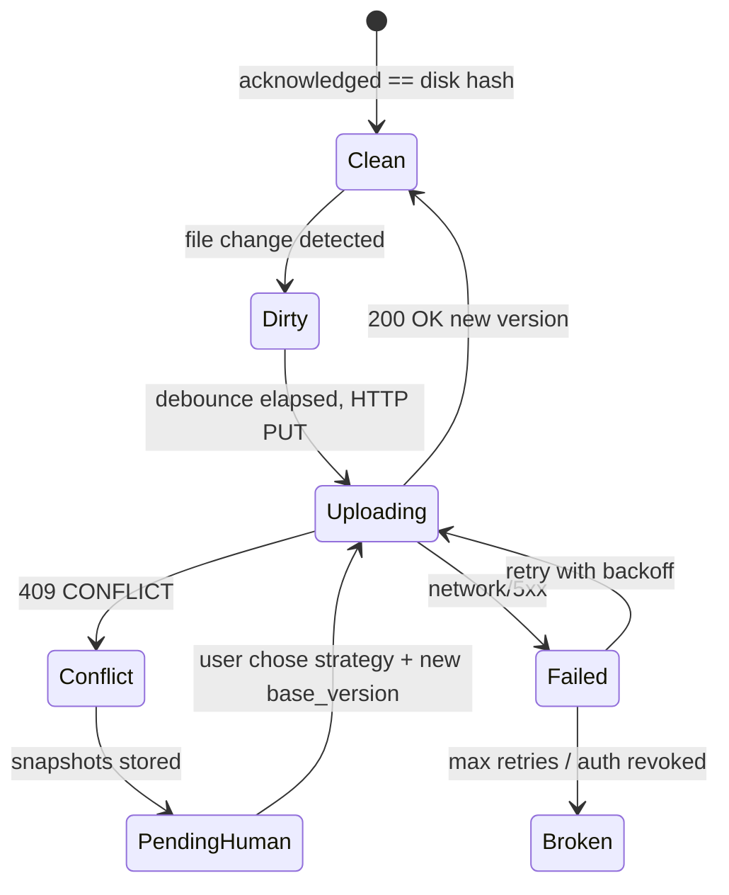

# ADR 0005: Synchronization protocol (local-first)

**Status:** Proposed  
**Date:** 2026-05-15  
**Depends on:** [0001-system-ownership.md](./0001-system-ownership.md), [0002-source-of-truth-matrix.md](./0002-source-of-truth-matrix.md), [0004-event-model.md](./0004-event-model.md), [0003-repository-structure.md](./0003-repository-structure.md)

This ADR defines the **end-to-end sync protocol** between the **local workspace**, **sync daemon**, **cloud API**, **Postgres**, **events/outbox**, and **dashboard projections**. It operationalizes document SoT rules from [0002](./0002-source-of-truth-matrix.md) §B and sync events from [0004](./0004-event-model.md) §8.

---

## 1. Sync philosophy

| Principle | Meaning |
|-----------|---------|
| **Local-first editing** | Users and tools edit **files in the workspace** immediately; latency to cloud is **not** required for local saves. The daemon is responsible for **eventually** reflecting accepted changes to the control plane. |
| **Cloud operational consistency** | After **acknowledgment**, **Postgres** holds the **authoritative version** for collaboration, policy, execution, and audit. All dashboards and remote actors read **server state** (or projections thereof). |
| **Explicit ownership** | Each `document_key` has a **single writer path** per direction: **local→cloud** via daemon+API; **cloud→local** via pull API + daemon apply. No silent third writers ([0001](./0001-system-ownership.md) §4). |
| **Deterministic reconciliation** | Given the same manifest state + server version + file bytes, the reconciliation outcome is **predictable** (same branch: fast-forward, conflict, or reject). No time-dependent randomness in merge rules. |
| **Version-aware synchronization** | Every push includes **`base_version`** (last server-acknowledged) and content **`hash`**; server responds with **409** + conflict body or **200/201** with **`new_version`**. |

---

## 2. Sync participants

| Participant | Role |
|-------------|------|
| **Local workspace** | Root directory registered for `workspace_id`; contains tracked files and **local manifest** (see §5). |
| **Sync daemon** | Watches allowlisted paths, debounces, hashes, builds patches, **uploads** and **pulls**, updates manifest, emits **`sync.*`** locally and triggers API commands that produce **`document.*`** server-side. |
| **Cloud API** | Validates authz, paths, size limits; applies patches **transactionally** with **outbox events**; returns version/ETag. |
| **Postgres** | Canonical `documents` (or equivalent) rows + `events` + `outbox`. |
| **Event / outbox system** | Records **`document.updated`** (and related) + **`sync.*`** as policy dictates; projectors update read models. |
| **Dashboard projections** | Read-only views fed by projectors; refreshed on poll/SSE after events—not a sync engine. |

---

## 3. Synchronization lifecycle

High-level pipeline (single document change, **push** path):

1. **File detection** — OS watcher (inotify/FSEvents) or polling fallback fires on path change.
2. **Debounce** — Coalesce rapid writes (e.g. 300–800 ms configurable) into one **batch_id**.
3. **Hashing** — Compute **`content_sha256`** of normalized bytes (UTF-8 NFC policy per ADR addendum if needed).
4. **Manifest update** — Stage row: `pending_ops` entry with `batch_id`, `path`, `hash`, `base_version`, `state=pending_upload`.
5. **Patch generation** — MVP: **full document body** + metadata; later: binary diff or CRDT patch.
6. **Upload** — `PUT /workspaces/{id}/documents/{key}` with `If-Match: W/"<base_version>"` or body field `base_version`.
7. **Acknowledgment** — On success: server returns `version`, `etag`, `recorded_at`; daemon marks manifest **acknowledged** and clears `pending_ops` for that op.
8. **Projection refresh** — API/outbox consumers update lists; dashboard sees new version on next query/SSE.
9. **Reconciliation** — On startup or after pull: compare manifest `last_ack_version/hash` vs disk; if disk diverged before ack, **enqueue push** or **conflict** per rules (§6).

**Pull** path (cloud→local): periodic or event-driven **GET** with `If-None-Match`; if changed, daemon writes file **atomically** (temp + rename) and updates manifest `last_pulled_version`.

---

## 4. Document model (canonical server fields)

Logical model (physical table names may vary):

| Field | Type | Description |
|-------|------|-------------|
| **`document_id`** | UUID | Stable row id. |
| **`workspace_id`** | UUID | Tenant/workspace scope. |
| **`document_key`** | string | Stable key, e.g. `governance/memory` (not host path). |
| **`version`** | int | Monotonic; increments on each successful content change (matches event `aggregate_version` for `aggregate_type=document` + this id). |
| **`hash`** | string | `sha256:` hex digest of canonical bytes. |
| **`metadata`** | JSONB | Title, MIME, labels, size, optional `last_editor`. |
| **`content`** | TEXT or blob ref | Body or pointer to object storage for large payloads. |
| **`updated_at`** | timestamptz | Server commit time. |
| **`updated_by`** | actor ref | User id or `system` / `daemon` service principal. |

**Client (manifest) mirror:** daemon stores `document_key → { local_path, last_ack_version, last_ack_hash, last_seen_hash, pending_op_id? }`.

---

## 5. Manifest / index architecture

### 5.1 Local manifest

- **Path:** `<workspace_root>/.ops/sync_manifest.json` (name illustrative; **not** under web-served dirs if any).
- **Purpose:** Recover after restart; dedupe uploads; drive reconciliation.

### 5.2 Tracked files

- **Config:** `sync.yaml` or server-registered **allowlist globs** per `workspace_id` (e.g. only `.claude/governance/memory.md` for MVP).
- **Normalization:** Store **repo-relative** paths; reject `..` segments.

### 5.3 Sync cursors

| Cursor | Meaning |
|--------|---------|
| **`pull_cursor`** | Last successfully applied **server `version`** (or ETag string) per `document_key`. |
| **`push_cursor`** | Last **acknowledged** `version` after upload. |
| **`event_cursor`** | Optional: last `event_id` / `recorded_at` consumed for SSE pull (advanced). |

### 5.4 Local revision tracking

- **`last_seen_hash`** — Hash observed on disk after last stable read.
- **`last_flushed_hash`** — Hash included in last successful or in-flight upload.

### 5.5 Pending operations queue

- Ordered list (or small SQLite) of **`pending_op`**: `{ op_id, document_key, base_version, content_hash, created_at, attempts, last_error }`.
- **Durability:** queue persisted to disk **before** HTTP attempt (at-least-once upload intent).

#### Manifest schema (MVP JSON)

```json
{
  "schema_version": 1,
  "workspace_id": "01H…",
  "tracked": {
    "governance/memory": {
      "relative_path": ".claude/governance/memory.md",
      "last_ack_version": 14,
      "last_ack_hash": "sha256:…",
      "last_seen_hash": "sha256:…",
      "pull_cursor_version": 14,
      "pending_op": null
    }
  },
  "daemon": {
    "instance_id": "01J…",
    "last_tick_at": "2026-05-15T12:00:00Z"
  }
}
```

---

## 6. Conflict handling

### 6.1 Optimistic concurrency

- Client sends **`base_version`** = last ack version for that key.
- Server accepts iff `base_version == current_version` (else **409 Conflict**).

### 6.2 ETag / version checking

- HTTP: **`If-Match: W/"14"`** or JSON `base_version: 14` (pick one in OpenAPI; both documented).
- Server returns **`ETag`** and JSON `version` on every successful write.

### 6.3 Strategies

| Mode | MVP | Later |
|------|-----|--------|
| **Default** | **Last-write-wins (LWW)** with explicit **409** when `base_version` stale; user chooses **overwrite server** or **rebase local** via dashboard/daemon UI. | Three-way merge for markdown, OT/CRDT for specific keys. |
| **Offline edits** | Local continues; `pending_op` stacks; on reconnect, **first** successful push wins others get **409** → branch to conflict UI. | |
| **Conflict snapshots** | On 409, server returns **`server_snippet_ref`** + version; daemon saves **`.ops/conflicts/<op_id>/`** local snapshot + server payload for diff. | |
| **Manual resolution** | Dashboard “resolve conflict” issues **command** → API applies **`document.resolved_from_conflict`** event with chosen side + new version. | |

### 6.4 Conflict lifecycle (state machine)



---

## 7. Sync directions

| Direction | Mechanism | Invalidation |
|-----------|-----------|----------------|
| **Local → cloud** | Daemon `PUT` / `PATCH` with `base_version` + hash | On ack, update `last_ack_*`; invalidate local “dirty” flag. |
| **Cloud → local** | Daemon `GET` If-None-Match / `since_version` | After atomic file write, set `last_seen_hash = last_ack_hash = pulled hash`. |
| **Projection refresh** | Projectors consume `document.*` / `sync.*` | Dashboard lists use **ETag** on list API or short TTL cache + `stale-while-revalidate`. |
| **Pull frequency** | MVP: **interval** (e.g. 60–300 s) + **on startup** + **on push conflict** + optional **SSE `sync_cursor`** later | |
| **Event-triggered refresh** | Client subscribes to **`document.updated`** feed (SSE/WebSocket) keyed by `workspace_id` | Reduces poll; still not SoT. |

---

## 8. Guarantees

| Guarantee | Definition |
|-----------|------------|
| **Eventual consistency** | If the daemon runs and network is restored, **all stable local changes** eventually reach server **or** enter **explicit conflict/failed** state—never silently dropped. |
| **Idempotency** | Same `client_op_id` / `idempotency_key` on `PUT` does not create duplicate versions (server returns same `version`). |
| **Retry behavior** | Exponential backoff; **respect `Retry-After`**; cap attempts; poison → `sync.failed` event + operator alert. |
| **Ordering** | **Per `document_key`:** total order of successful versions = integer `version` order. Cross-key order irrelevant for MVP. |
| **Durability** | Acked writes durable in Postgres + events/outbox same transaction ([0004](./0004-event-model.md) §5). |
| **Replay** | Rebuild manifest from server **export** endpoint if local manifest corrupted (§9). |

---

## 9. Failure handling

| Failure | Handling |
|---------|----------|
| **Network** | Queue in `pending_ops`; backoff; classify transient vs permanent. |
| **Partial sync** | Writes use **temp file + rename**; manifest updated **only** after full write + hash verify. |
| **Daemon restart** | Reload manifest; reconcile disk hash vs `last_ack_hash`; resume `pending_ops`. |
| **Corrupted manifest** | **GET /workspaces/{id}/sync/manifest** (optional) or full document fetch to rebuild `tracked` from server allowlist + disk presence. |
| **Stale projections** | Projector lag metric + `system.projector_lag_breached`; dashboard shows “stale” badge if `now - projection_updated_at > SLO`. |
| **Duplicate operations** | Dedupe by `client_op_id`; server returns idempotent response. |

---

## 10. Security boundaries

| Control | Rule |
|---------|------|
| **Workspace isolation** | All paths resolved under **`workspace_root`** canonicalized; reject escape. |
| **Allowed paths** | Only **registered globs**; deny symlink escape (policy: no symlinks out of root, or resolve once and verify). |
| **Path traversal** | Reject `..`, Windows device paths, and UNC where applicable. |
| **Credentials** | Daemon uses **scoped token** (workspace-scoped JWT or API key); **no** service account for user home outside workspace. |
| **File filtering** | Max size, binary denylist, extension allowlist for MVP; secrets filename denylist (`.env`, `*.pem`). |

---

## 11. Anti-patterns (merge-blocking)

| Ban | Rationale |
|-----|-----------|
| **Silent overwrite** | Violates audit and [0001](./0001-system-ownership.md) §4; always emit events + visible version bumps. |
| **Direct dashboard filesystem access** | Breaks security and SoT ([0001](./0001-system-ownership.md) §4). |
| **Daemon-triggered AI execution** | Sync is I/O only ([0001](./0001-system-ownership.md) §4). |
| **Full tree rescans every loop** | O(n) disk thrash; use watchers + manifest dirty flags. |
| **Mutable sync history** | Append-only **`sync.*`** / **`document.*`** events; manifest may be rewritten but **server log** never deletes history. |
| **Uncontrolled bidirectional writes** | Both sides writing without version checks → data fork; require explicit pull/push phases + cursors. |

---

## 12. MVP sync slice

| Item | Scope |
|------|--------|
| **Document types** | **One** `document_key` (e.g. `governance/memory`). |
| **Workspaces** | **One** `workspace_id`. |
| **Flow** | **Local → cloud** push with **`base_version`** + **ack**; optional **cloud → local** pull on interval to prove bidirectional read path. |
| **Conflict** | **409** + snapshot files + dashboard banner listing conflict id. |
| **Events** | Emit **`sync.file_detected`**, **`sync.started`**, **`sync.committed`**, **`sync.conflict_detected`**, **`sync.failed`**, and API emits **`document.updated`** ([0004](./0004-event-model.md) §8). |
| **Dashboard** | Shows `version`, `hash`, `updated_at`, `sync_state` from projection API. |

---

## Output artifacts (summary)

### Sync state machine (daemon-centric)

See §6.4 diagram (Clean → Dirty → Uploading → Clean / Conflict / Failed).

### Sync protocol (normative sequence)

**Push (happy path):** detect → debounce → hash → manifest `pending_op` → `PUT` + `base_version` → `200` → manifest ack → `sync.committed` (daemon) + `document.updated` (API) → projections.

**Pull:** `GET` with `If-None-Match` → `304` exit / `200` → atomic write → manifest cursors updated → optional `sync.committed` local note.

### Manifest schema

See §5.5 JSON.

### Reconciliation rules (deterministic)

| Condition | Action |
|-----------|--------|
| `disk_hash == last_ack_hash` | **Clean**; no upload. |
| `disk_hash != last_ack_hash` and no `pending_op` | **Dirty** → enqueue upload with `base_version = last_ack_version`. |
| `pending_op` exists and same `content_hash` | **Retry** upload (idempotent). |
| `409` on upload | **Conflict**; freeze auto-push; require resolution command. |
| Server `version > pull_cursor` on pull | **Apply** server body if local clean or policy allows overwrite; else **conflict**. |

### Conflict lifecycle

See §6.4 state machine + §6.3 snapshots and manual resolution.

### Operational guarantees

Summarized in §8; tied to **Postgres txn** + **outbox** for authoritative writes.

### Daemon responsibilities

Watch + debounce + hash + manifest + HTTP push/pull + retry + conflict file artifacts + **never** DB/AI.

### API interaction contract (MVP sketch)

| Method | Path | Headers / body | Responses |
|--------|------|------------------|-----------|
| `PUT` | `/v1/workspaces/{wid}/documents/{key}` | `Authorization`, `If-Match: W/"{v}"`, body `{ content, client_op_id, content_sha256 }` | `200` + `{ version, etag, updated_at }`; `409` + `{ current_version, current_hash, conflict_id }`; `412` if If-Match invalid |
| `GET` | `/v1/workspaces/{wid}/documents/{key}` | `If-None-Match` | `200` / `304` |
| `GET` | `/v1/workspaces/{wid}/documents` | — | List for dashboard projection source |

OpenAPI lives under `docs/api/` when implemented; this ADR is the **normative behavior** those specs must satisfy.

---

## References

- [0001-system-ownership.md](./0001-system-ownership.md)
- [0002-source-of-truth-matrix.md](./0002-source-of-truth-matrix.md)
- [0004-event-model.md](./0004-event-model.md)
- [0003-repository-structure.md](./0003-repository-structure.md)
